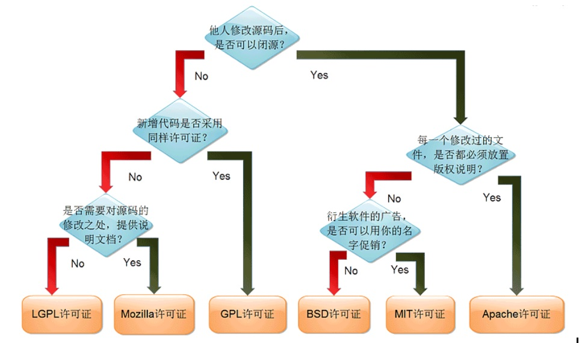

# 开源的许可证GPL、LGPL、BSD、Apache 2.0的通俗解释

各种开源的许可证主要的限制还是在redistribution（发布），所以个人/商业公司开发的软件包含了GPL的代码，只要你不发布，是可以任意使用的。

下面是几个开源许可证的区别：

## GPL

GPL软件的使用者有权力得到软件的代码，只要使用了GPL，在发布(redistribution)时，整个项目也必须是GPL的，即主程序和静态链接的库（linux的.a和Windows的.lib）必须是GPL的，动态链接库(Linux的.so，Windows的.dll)必须是GPL兼容的。所谓GPL兼容，也就是GPL软件中可以使用的库，这些许可证必须比GPL弱(如LGPL，BSD)，而不能是某个商业许可证。正因如此，GPL是带有很强的传染性，只要你的软件使用了GPL的代码，那么就请以GPL开放源代码吧，并且你的项目中也不能有任何和GPL不兼容的库。

## LGPL

GPL 带有很强的传染性，那么如果一个库使用GPL发布，那么使用这个库的所有软件也必须使用GPL发布，这对不想开放源代码的商业软件来讲是致命的打击——你可以不使用其他的库，但最基本的libc是无论如何绕不开的，如果libc是以GPL发布，就相当于所有软件必须以GPL发布了。所以，LGPL(Lesser GPL)诞生了。

　　LGPL定义为，在以LGPL发布的库的基础上开发新的库的时候，新的库必须以LGPL发布，但是如果仅仅是动态链接，那么则不受任何限制。这样商业软件就可以随意的使用LGPL的库了。因此，LGPL也具有传染性，但限制在其基础上开发的库上，而并不限制使用它的程序本身——它的传染性远小于GPL。

## BSD, Apache 2.0

相对GPL/LGPL的开放源代码，BSD，Apache 2.0就宽松许多——商业软件可以任意的使用BSD，Apache 2.0发布的软件代码，而不需要开放源代码，只需要提及代码的原出处就可以了。BSD和Apache 2.0提及的方式稍有不同，具体可以参考协议的详细内容。它们是GPL兼容的

