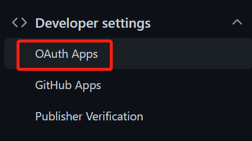

## 授权

这里介绍了Github各种授权方式:

[About authentication to GitHub](https://docs.github.com/en/authentication/keeping-your-account-and-data-secure/about-authentication-to-github)

[Web 应用的授权方式在这里](https://docs.github.com/en/developers/apps/building-oauth-apps/authorizing-oauth-apps#web-application-flow)

准备：

首先你需要在Github上注册一个应用，注册地方在你的账户 settings 左边栏最下面：

填写网站主页、默认回调url，就可以提交了。Github将给你一个 Client ID，用这个ID来获取 access token。

OAuth授权基本步骤：

1. 引导用户访问 Github 授权页面。

2. Github 授权后，跳转回你的网站。

3. 你的网站使用 access token 访问 API。

下面是Web应用接入的具体过程。

## Github REST API

[REST API](https://docs.github.com/en/rest/guides/getting-started-with-the-rest-api)

第三方库 octokit 竟然停掉了，Github要出官方的SDK。因此对于简单应用，还是直接使用API比较好。

