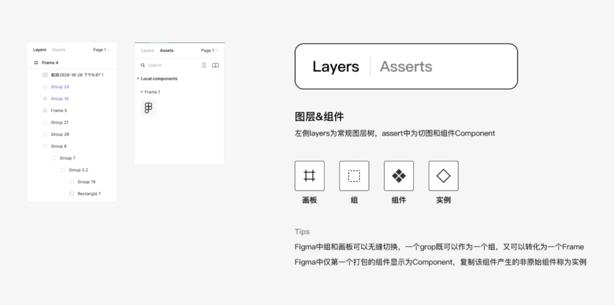
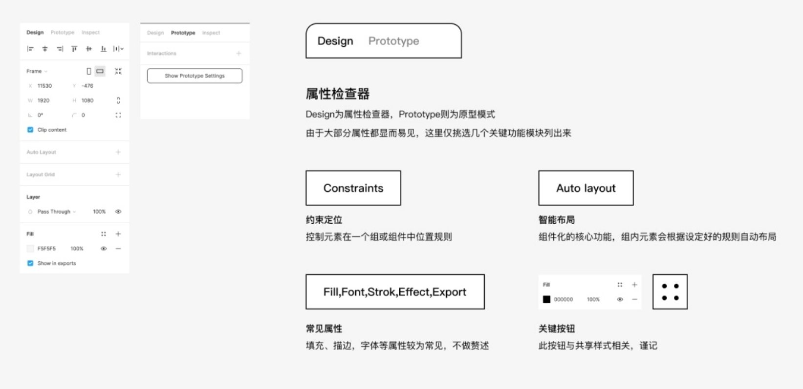

[Figma全指南，看这一篇就够了](https://zhuanlan.zhihu.com/p/266781187)

[Figma入门级教程 | 01](https://zhuanlan.zhihu.com/p/348934637)

## 入门

[万字干货！写给小白的Figma全面入门手册](https://www.uisdc.com/figma-getting-started-manual)

图层组件

左侧为常见的图层导航栏，可通过顶部在图层和组件两个模块间切换，上图中展示了图层树中不同元素的缩略图样式，其中组件和实例比较特殊，简单理解，实例是组件的复制体，需要注意的是，组件不可逆，而实例是可以逆向为Group的，也就是取消组件化。

属性检查器

