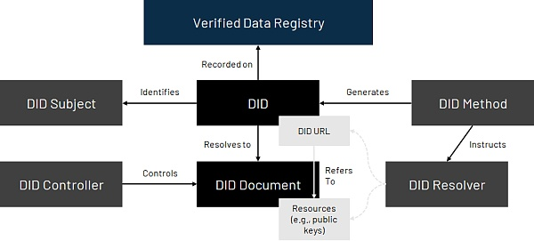

# 去中心化身份认证

Decentralized Identity - DID

账户和密码服务的主要服务商：Okta, 1Password, and Dashlane.

最主要的问题是，用户并不拥有自己的账户资源，账户资源由互联网公司掌握。

The W3C’s DID specification is a widely accepted standard that ensures that identity systems can interoperate across different networks and platforms.

An overview of the DID architecture is shown below. A DID is an address on the Internet that someone can directly own and control. It can be used to find and connect DID documents, which contain DID related information. DID documents contain information that can support use cases such as login, data encryption, communications, etc. And cryptographic proofs, such as digital signatures, allow the relevant entity to claim property rights.

